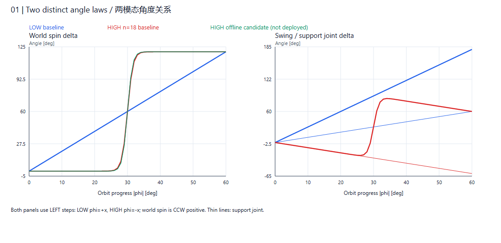
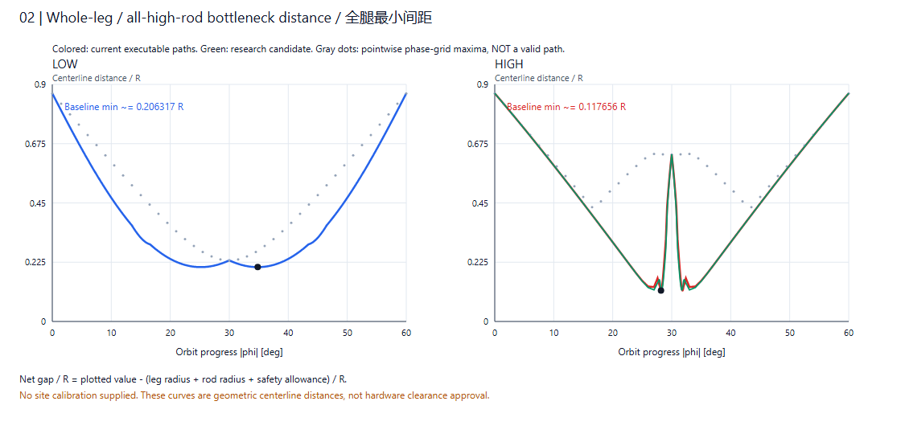
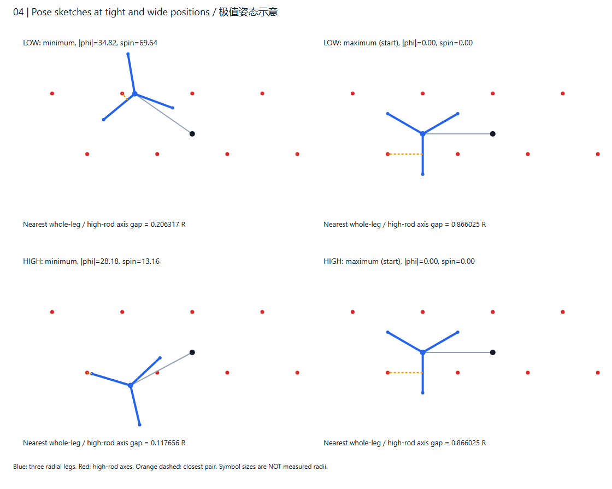
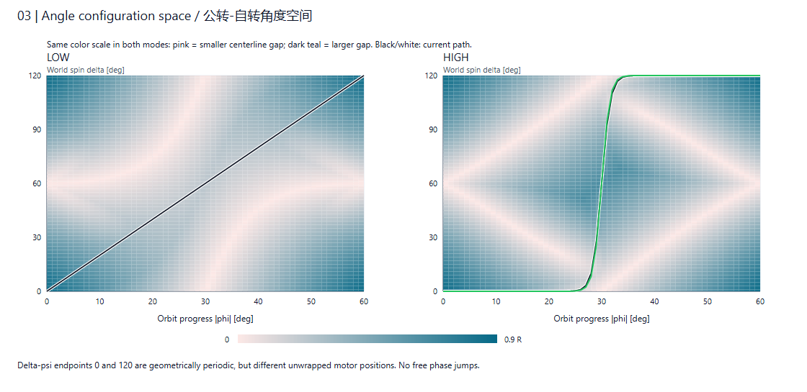
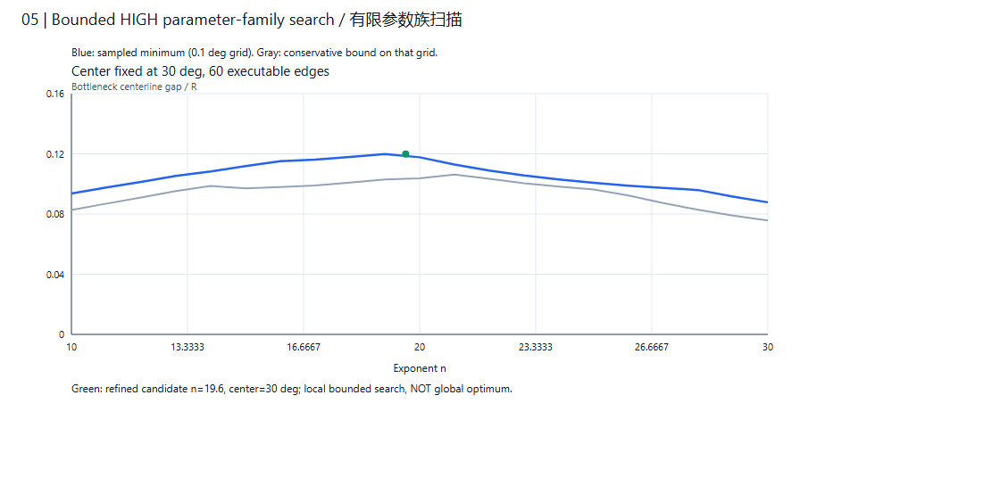

# 三足腿—高杆避让：自转—公转联动专项调研报告

日期：2026-09-24。审查基线：`main` / `57dc02bd1a0c40d41c7845e8940a3d7d9f5b4de3`。

性质：代码审查、数学分析与离线试算；不是新控制方案的实施或实机验收。

本次新增研究报告、独立委托说明、离线复现脚本、曲线和原始数据，没有修改生产控制代码、现场配置或固件，没有驱动电机。本研究按独立分支交付，不直接合并主线；主线审阅入口为 [控制逻辑交接说明](HANDOFF_2026-09-24_GAIT_RESEARCH_BRANCH.md)。

交给其他人分析时，优先发送 [完整资料包](handoff_gait_avoidance_research_2026-09-24.zip)，入口为 [独立委托分析说明](EXTERNAL_BRIEF_2026-09-24_GAIT_CLEARANCE_OPTIMIZATION.md)。新增数值结果与配图见第11节；第6节保留原来较粗网格的对照，不与细网格结果混用。

## 1. 核心结论：两种模态是否已经单独建模？

**已经分别建立两种候选角度轨迹模型，并分别进行扫掠校验；但没有建立两套完全独立的机构／动力学模型，也尚未完成两类模态各自的最优路径求解。**

当前架构准确地说是：一套机构几何与安全判据、两类轨迹策略、一个公共执行器。

| 层次 | 当前实现 | 是否分别建模 |
| --- | --- | --- |
| 机构与障碍几何 | 紧贴六边形晶格、交错高低杆、三条完整径向腿 | 共用；按当前支点重建邻域 |
| 模态识别 | 按当前支点方位和公转方向分类 | 是，明确输出 LOW / HIGH |
| 自转—公转规律 | LOW 比例函数；HIGH 指数18变比例函数 | 是，并非只改变电机 DIR |
| 碰撞校验 | 全部腿与邻域高杆的平面距离 | 共用判据，分别检查各自轨迹 |
| 电机转换 | 世界姿态→相对横梁关节角→脉冲 | 共用；应用各轴方向与标定 |
| 运动执行 | 公共五次进度的原子 SYNC | LOW 一段；HIGH 60段 |
| 最优路径／动力学／闭环 | 无完整惯量、力矩、接触模型与编码器反馈 | 尚未完成，不能宣称已有 |

**低节点侧不是只检查低杆。两种模态都在避让高杆；名称表示本次公转扇区相对交错节点的位置。**

应继续分别研究两类轨迹，但不应复制两套碰撞或串口代码。共用安全判据可避免四种动作出现不同口径。

## 2. 审查范围与证据

当前行为以源码为准；原始需求解释目标，旧交接文档用于追溯历史。

| 资料／源码 | 核对内容 |
| --- | --- |
| [原始需求](handoff_control_method_utf8.txt)、[控制检查](handoff_motor_control_check.txt) | 连续扫掠、世界相位与关节角、支撑要求；后者按 GBK 解码 |
| [gait_avoidance.py](../motor_control/gait_avoidance.py) | 模态识别、两类轨迹、折线插值、完整腿碰撞 |
| [gait_planner.py](../motor_control/gait_planner.py) | 几何、邻域、间隙保守下界、分段时长 |
| [gait_executor.py](../motor_control/gait_executor.py) | 双轴 DONE 等待、顺序执行及中止 |
| [desktop_app.py](../motor_control/desktop_app.py) | 当前站位、脉冲累计端点、误差包络与预检 |
| [sync_math.h](../esp32_stepper/src/sync_math.h)、[stepper.cpp](../esp32_stepper/src/stepper.cpp) | 固件公共时基、DDA 与脉冲限制 |
| [gait_tab.py](../motor_control/ui/gait_tab.py) | 固定帧率几何动画与真实执行节奏的区别 |
| [专项测试](../tests/test_gait_avoidance.py) | 两模态、四方向、重分类、执行异常 |

本机根目录没有 `.gait_params.json`，不能复现远端现场的绝对毫米间隙。下文参考尺寸不是重新标定，也不表示远端环境或现有运行效果有问题。

## 3. 共用机构模型与模态分类

### 3.1 坐标及几何

紧贴正六边形的中心距为 `d=√3R`，R 为节点环半径及径向腿长度。

- 低节点方向：30°、150°、270°；高节点方向：90°、210°、330°。
- 公转 φ 正方向为俯视顺时针；世界自转 ψ 正方向为逆时针。
- 横梁世界方位：`β=β_start−φ`。
- 支点为 P，支点指向初始摆动端的方位为 θ。

```text
O(φ) = P + d·[cos(θ−φ), sin(θ−φ)]
第j条腿：O 到 O + R·dir(ψ+120°j)，j=0,1,2
Δq_swing   = Δψ + φ
Δq_support = φ
```

电机安装符号、PPR、减速比在之后转换为脉冲时应用。世界自转方向、关节方向、公转方向不能混为一谈。

腿按完整径向线段加半径处理，不只检查爪尖、不忽略根部；高杆按平面圆形截面处理。本专项不以抬升高度豁免腿的平面冲突。

### 3.2 两种模态如何区分

公转扇区中分方位 `m=θ−φ_end/2`：

- `m≡30° (mod 120°)`：LOW，公共低节点侧。
- `m≡90° (mod 120°)`：HIGH，公共高节点侧。

当前支持相邻支座 `φ_end=±60°`，对齐容差0.5°。120°旋转保持同类节点排列；60°扇区变化涉及高低交错，不能把所有换位视为相同障碍场景。

初始左足A、右足B时，未乘电机安装符号的角度如下：

| 动作 | 路由 | 模态 | 世界Δψ终值 | Δq摆 / Δq支终值 |
| --- | --- | --- | --- | --- |
| 左顺移 | A→C，绕B | LOW | +120° | +180° / +60° |
| 右逆移 | B→C，绕A | LOW | −120° | −180° / −60° |
| 左逆移 | A→邻座(0,-1)，绕B | HIGH | +120° | +60° / −60° |
| 右顺移 | B→邻座(0,-1)，绕A | HIGH | −120° | −60° / +60° |

这是初始站位映射，不是按钮永久属性。左顺完成后，从C/B站位右顺，变为LOW。代码已按每步站位重新分类。

### 3.3 共用碰撞判据

对三条腿j和邻域高杆k求：

```text
D(φ,ψ) = min dist(腿j中心线段, 高杆k轴线) − r_leg − r_rod − δ
L_i = min(D_i,D_{i+1}) − (d·|Δφ_i| + R·|Δψ_i|)/2
```

第二式角度须转弧度。至少检查600个公转区间，并加入全部执行节点；取所有L_i的最小值作为连续净间隙保守下界。下界非正表示未能证明可行，不等于已经定位真实接触点。

两模态区别在于走过哪些 `(φ,ψ)`，不在于对碰撞采用不同定义。实机还要覆盖脉冲及初始相位误差；现有预算不等于已包含实测回差、弹性、失步或支点滑动。腿避杆通过也不等于全机碰撞与支撑稳定性验收通过。

## 4. LOW：反向比例自转模型

令 `u=φ/φ_end∈[0,1]`、`σ=sign(φ_end)`：

```text
Δψ_LOW = σ·120°·u = 2φ
Δq_swing = 3φ
Δq_support = φ
```

因φ与ψ正方向相反，此处正比例表示世界自转与公转反向。角度路径为直线，一条双轴SYNC即可表达，无需切成60段。

特点：关节比例固定，正常S4无关节换向，执行简单；但仍是固定候选，而非全局最优求解结果。如果现场稳定，应保留为基准，优先研究机械负载允许的速度与启停平顺性，不应为统一函数而换成HIGH规律。

## 5. HIGH：同向集中调相模型

### 5.1 当前函数与执行折线

```text
F_n(u) = u^n / [u^n+(1−u)^n]
Δψ_HIGH = −σ·120°·F_n(u)
n = 18
```

F单调且满足 `F(1−u)=1−F(u)`；前后少转、中间集中调相。当前程序在 `u=i/60` 取61节点，实际执行60段角度折线。每段共享五次时间进度，等待两轴DONE后再发下一段。

预览和碰撞校验使用同一折线。生成公式光滑，不代表电机全程无停顿；应分别评价公式、折线、时间安排与实际机械跟随。

### 5.2 角度比与实际速度

`F'_n(0.5)=n`，所以中点：

```text
d(Δψ)/dφ = −2n = −36
d(Δq_swing)/dφ = 1−2n = −35
```

当前折线最大世界自转／公转角度比绝对值约32.2325，摆动关节对应约31.2325。

源码注释的指数18峰速2.25倍公转，以及指数6峰速0.75倍公转，与公式导数和折线比例不一致。**这是说明口径错误，不等于固件实际超速。**

公转峰值参数设为6°/s时，执行器通过延长段时间，将摆动关节计划峰值限制为18°/s。最陡的1°公转段约3.2534s，其公转峰值约0.5763°/s；完整S4计划约28.0928s，不含通信、调度与人工确认开销。

因此实际策略是中段明显放慢公转完成调相，不是保持公转恒速令自转无限加速。

### 5.3 关节换向

左逆移的世界自转单调增加，但关节角先减、再增、最后再减：

```text
0° → 最低约−25.048° → 最高约+85.048° → 最终+60°
```

这两次关节反向要求独立核查回差、换向响应、全程限位和支点稳定性。不能只核对终点+60°。60段停车与两次方向反转是两回事：不是每段都反转，但每段都按静止到静止规划。

## 6. 离线对比试算

### 6.1 方法与数据口径

使用现有计划器，只在独立Python进程内改变候选参数或函数，不写回源码。参考参数：R=40mm，腿半径4mm，杆半径5mm，δ=2mm；两模态自动取d=√3R。公转峰值参数6°/s，采样参数默认120，实际至少600区间。

以下使用无量纲指标：

```text
G_sample = (采样净间隙最小值 + r_leg+r_rod+δ) / R
G_bound  = (连续净间隙保守下界 + r_leg+r_rod+δ) / R
```

它们是中心线距离及其保守下界相对腿长的比值，**不是扣除实体厚度后的安全净间隙**。负G_bound表示保守界未证实正间距，不是物理距离为负。

现场完全符合模型时，几何门槛可写为 `R·G_bound > r_leg+r_rod+δ`；实机还需覆盖脉冲、标定及已确认的机械误差。尺寸可归一化，但实体相对粗细不会消失，不能宣称尺寸与安全无关。这些量应作为一次性机构标定，而不是日常重复输入。

### 6.2 两类轨迹互换的对照

保持实际公转方向和障碍几何不变，仅换用另一模态的自转规律；终点仍三重对称等效。

| 实际几何模态 | 使用轨迹 | G_sample | G_bound |
| --- | --- | ---: | ---: |
| LOW，左顺 | 正确LOW比例曲线 | 0.206317 | 0.203061 |
| LOW，左顺 | 错换HIGH指数18曲线 | 0.001559 | −0.015503 |
| HIGH，左逆 | 正确HIGH指数18曲线 | 0.117945 | 0.100883 |
| HIGH，左逆 | 错换LOW比例曲线 | 0.000355 | −0.002902 |

该结果支持分模态设计：**终点等效不代表中途可互换**，不能将四动作简化为同一条自转曲线仅改变DIR。

### 6.3 HIGH指数比较，保持60段

| 指数n | G_sample | G_bound | 计划S4时长/s |
| --- | ---: | ---: | ---: |
| 6 | 0.061911 | 0.055225 | 24.2323 |
| 10 | 0.093607 | 0.082694 | 26.3165 |
| 14 | 0.108247 | 0.098695 | 27.3454 |
| 18，当前 | 0.117945 | 0.100883 | 28.0928 |
| 24 | 0.102912 | 0.098159 | 28.6087 |
| 36 | 0.072847 | 0.063482 | 29.3807 |

18在本次离散候选中最好。继续增大指数，间距反而下降、时间增长；不能据此证明18是全部指数或所有函数族的全局最优。

参考尺寸下，当前净间隙下界约 `40×0.100883−11=−6.9647mm`，不是远端提交说明中的+1.8mm。这里是占位尺寸，二者不能直接对比；本报告不否定现场结果，也不把未保存现场参数的说明视为本机复现证据。

### 6.4 分段密度与替代曲线

保持n=18，执行分段数变化：

| 执行段数 | G_sample | G_bound |
| --- | ---: | ---: |
| 60 | 0.117945 | 0.100883 |
| 120 | 0.118603 | 0.104783 |
| 240 | 0.119159 | 0.105192 |

加密改变实际执行折线，略微改善数值间距；但旧执行器仍逐段停车，因此增加段数不等于改善实机平顺性。碰撞校验网格与执行节点密度是不同参数，应分别研究。

还试算了中心在公转绝对值30°、窗口外自转不变、窗口内五次smoothstep的候选。半窗口宽度3°、4°、5°、6°、仍60段时，G_bound依次为0.085420、0.096505、0.092243、0.084096，均未超过当前0.100883。

这表示本次简单替代候选暂未证明更好，不代表所有多项式或样条都不适用；没有进行完整函数族或不对称路径优化。

## 7. 时间安排与平顺性

### 7.1 当前时长公式与动力学缺口

每段采用五次进度 `S(x)=10x³−15x⁴+6x⁵`，x=t/T：

```text
T_i = max(0.05s,
          1.875·|Δφ_i| / V_orbit,
          1.875·|Δq_swing_i| / (3V_orbit))
```

另有脉冲率、段时长、分辨率及限位预检。五次插值段端速度、加速度为零，但没有按各轴机械能力明确约束最大加速度或加加速度。

单关节段位移Δq的理想峰值为：

```text
v_peak = 1.875·|Δq|/T
a_peak = (10√3/3)·|Δq|/T²
j_peak = 60·|Δq|/T³
```

V_orbit=6°/s，对两关节和所有段取最大值：

| 模态 | 段数 | S4时长/s | a_peak，°/s² | j_peak，°/s³ |
| --- | ---: | ---: | ---: | ---: |
| LOW | 1 | 18.7500 | 2.956 | 1.638 |
| HIGH，n=18 | 60 | 28.0928 | 91.837 | 2363.974 |

这些是理想插值计算值，不是实测电机响应，不包含离散脉冲、通信暂停、摩擦、负载和振动。它们提示HIGH短段反复启停值得独立研究，不能直接据此认定现场失步或不安全。

### 7.2 路径优化与时间优化应分开

- 路径层：给定公转角，选什么自转角才能通过高杆。
- 时间层：沿已验证路径，什么时候加速、减速、换向。

只调整共享时间进度，不改变理想几何路径；但若两轴独立平滑，可能改变角度关系。TOPPRA以给定几何路径和关节速度、加速度等约束求时间参数化，本项目可借鉴这种分层，不代表已经引入该库。[TOPPRA官方文档](https://hungpham2511.github.io/toppra/index.html)

Ruckig提供速度、加速度和加加速度约束；其途经点方案联合处理路径与时间。因此不能假定输入现有节点就会保留已验证的避杆曲线，任何实际插值改变仍须重验。[Ruckig官方文档](https://docs.ruckig.com/)

### 7.3 不能直接删除DONE等待

当前角度折线有拐点。若保持折线完全不变，并以非零共享进度速度通过一般拐点，会导致关节速度比例或方向不连续。固件缓冲能减少通信等待，却不能自动解决几何拐点。

连续运动需要在安全余量内平滑角度路径或采用其他可验证插值，随后共同设计时间进度、缓冲、急停和进度报告；不能只追求两个轴终点同时到达。

## 8. 下一阶段建议：分别优化，共用安全底层

### 8.1 冻结可复现基线

建议记录：公式／指数、执行节点、几何比例与实测半径、零位与方向标定、PPR／减速比、软件和固件提交、最紧腿／杆标识、运行日志及视频。

`two_mode_v1`名称未随指数6→18改变，参数保存中也没有独立的指数／节点算法版本。所以只有配置JSON不足以复现历史轨迹，必须同时记录软件版本。

### 8.2 分别建立可行角度区域

对LOW和HIGH分别建立 `D_LOW(φ,ψ)`、`D_HIGH(φ,ψ)`，得到满足厚度、间隙、误差预算的角度区域。两者是同一碰撞模型在不同公转扇区上的取值，而不是两套不同的安全标准。

随后在二维角度空间寻找连续路径。不能在每个φ独立选距离最大的ψ：这些点可能不连通或要求关节跳变。该思路属于配置空间规划，起终点还需要处在相连的自由区域中。[Modern Robotics：配置空间障碍](https://modernrobotics.northwestern.edu/nu-gm-book-resource/10-2-c-space-obstacles/)

建议优化顺序：

1. 安全间隙、支撑、行程作为硬约束。
2. 在可行解中提高全程最小间隙与误差容忍度。
3. 在余量足够的路径中降低斜率／曲率、总行程与回差敏感性。
4. 最后在机械速度、加速度和加加速度约束下改善时间。

LOW优先保留比例模型；HIGH以n=18为基准，研究受约束曲线与共享时间进度。不能未经重验就强制消除现有两次关节换向。

### 8.3 对称性与唯一解的边界

理想晶格支持镜像复用，但不等于证明真实机构的唯一最优路径。有限指数或中心偏移扫描，也不能证明所有曲线中不存在更好解。

现场杆位偏差、左右腿厚度、回差和变形可能不对称，四动作的实际余量应分别验收。30°可保留为当前对称中心和优化初值。本报告没有独立复现远端中心偏移±1.2°转负的现场扫描，不把提交说明提升为一般定理。

## 9. 文档与实现差异

| 项目 | 当前情况 | 后续建议 |
| --- | --- | --- |
| 旧交接指数 | [9月23日交接](HANDOFF_2026-09-23_TWO_MODE_LEG_AVOIDANCE.md)写n=6，源码为18 | 按版本区分历史与当前 |
| 关节极值 | 旧约−18.2°/+78.2°，现约−25.048°/+85.048° | 更新限位核对数据 |
| 速度注释 | 2.25倍公转混淆角度比与限速 | 分别记录导数、轴限速和实际公转速度 |
| 只与角度有关 | 联动规律不需独立中心距，但实体比例决定安全 | 区分日常参数与机构标定 |
| 动画平顺性 | 固定帧推进不是实际分段时间 | 后续增加按计划时间回放的评估视图 |
| 最优性 | 当前为两条固定候选，无全局最优证明 | 准确区分候选、模型通过和现场验收 |

本轮只在研究资料中记录差异，没有改动历史交接文档、生产注释或控制逻辑。

## 10. 本轮验证及后续验收

本轮命令：

```powershell
.\.venv\Scripts\python.exe -B -m unittest discover -s tests -p test_gait_avoidance.py -v
```

**19项全部通过**，涵盖模态、四方向、后续站位、镜像、连续间隙保守界、累计脉冲、中间限位、零脉冲伙伴、中止和丢ACK等。

扫描调用纯规划函数；执行测试使用fake-serial。本轮没有重跑全项目测试、编译固件或做实机验收，不以历史测试数量替代本轮结果。

后续应分别报告LOW/HIGH，再覆盖四动作及后续站位：

- 几何：净间隙下界、误差预算、最紧腿／杆、公转角；平滑后重验全部扫掠。
- 运动：关节极值、行程、换向点、速度／加速度／加加速度及时间。
- 实机：停止次数、耗时、回差、支点稳定性、振动及失步迹象。
- 一致性：预览、校验、脉冲执行对应同一路径与版本。
- 异常：急停、断连、缓冲耗尽、进度异常不得继续下一段或自动落脚。

仍需现场资料：真实扫掠实体与高杆高度重叠范围、腿／杆半径、杆位偏差、两旋转轴参数与负载、允许加速度、回差、当前配置及视频。取得这些信息后，才能把参考模型优化升级为实际机构优化。

## 11. 补充研究：曲线、极值与可委托的数值优化问题

### 11.1 先区分三种“间距最大”

令 `g(φ,ψ)=min[j,k] dist(完整腿j中心线段, 高杆k轴线)/R`。它已经是当前姿态所有腿与所有高杆的最小距离，不能任选一对较远的腿／杆作为安全指标。

| 问题 | 数学含义 | 能否直接评价整段避让 |
| --- | --- | --- |
| 固定轨迹的最宽姿态 | `max_x g(φ(x),ψ_current(x))` | 不能；最宽不代表途中最窄安全 |
| 固定公转角的最佳相位 | `max_ψ g(φ,ψ)` | 不能；各角度独立最优相位可能无法连续连接 |
| 最优避让路径 | `max_{连续路径ψ(x)} min_x g(φ(x),ψ(x))` | 是主要目标，但还要满足端点、行程、厚度和执行约束 |

**可以建立数值模型求极值；真正值得优化的是全程最小间隙的最大值，而不只是寻找一个最宽姿态。** 函数取多个距离的最小值，最紧腿／杆会切换，因此可能不可微；不能只对单条距离函数求导后就声称求出了避让最优解。

以下统一以左足两动作画图：`x=|φ|∈[0,60°]`，LOW 的φ=+x、HIGH 的φ=−x；纵轴自转量均为世界系逆时针正的Δψ。右足镜像结果及四动作符号列在独立说明和 CSV 中。

### 11.2 角度曲线和关节转换



[矢量原图](assets/gait_avoidance_2026-09-24/01_angle_curves.svg)。蓝色LOW为比例曲线；红色HIGH为当前n=18折线；绿色是研究候选，未部署。右图细线是支撑关节，粗线是摆动关节，不能把世界自转量当作电机转角。

### 11.3 当前路径的最宽、最窄位置

保持现有实际角度折线不变，按0.01°公转网格采样，并加入全部执行节点。下表距离均是中心线距离除以R，**还未扣除腿厚、杆厚和误差**。

| 路径 | 采样最小值g | 最窄进度x/° | 对应世界Δψ/° | 采样最大值g | 最宽进度x/° |
| --- | ---: | --- | --- | ---: | --- |
| LOW当前 | 0.20631687 | 25.18、34.82 | 50.36、69.64 | 0.86602540 | 0、60 |
| HIGH当前，n=18 | 0.11765641 | 28.18、31.82 | 13.15564、106.84436 | 0.86602540 | 0、60 |
| HIGH研究候选，n=19.6 | 0.11979543 | 28.28、31.72 | 13.03413、106.96587 | 0.86602540 | 0、60 |

极值角度是该网格上的估计，不是解析精确根，也不是全部可选轨迹的最优角。更密0.005°网格下，当前HIGH采样最小值约0.11764927，候选约0.11978687；保留足够小数是为了复核，并不表示实机具备这种精度。



[矢量原图](assets/gait_avoidance_2026-09-24/02_clearance_curves.svg)。灰点是在该公转角上遍历相位网格得到的最大距离，不是一条已经可执行的路径。

两条当前轨迹的采样最宽处都是起／终点；这与途中能否通过最窄位置是两个问题。特别是HIGH：x=30°、Δψ=60°时g≈0.63397460，明显高于两肩约0.11765。因此**中点局部余量较大，不代表中点前后的扫掠安全；最窄处在两肩。** LOW中点g≈0.23205081，也略大于其两侧最小值。



[矢量原图](assets/gait_avoidance_2026-09-24/04_extremum_poses.svg)。蓝线为三条完整径向腿，红点为高杆轴线，灰线示意中心连杆，橙色虚线为最近点对；图示线宽／点半径不是实物厚度。LOW图选择两个等价最小值中的后一个。

最紧腿索引、高杆索引、杆坐标和腿上最近点已记录到 [critical_pose_pairs.csv](assets/gait_avoidance_2026-09-24/critical_pose_pairs.csv)。存在并列最近杆时，文件确定性地给出其中一对；完整杆集保留在JSON，复核者可以枚举所有并列点对。

### 11.4 分别建立两模态的角度空间



[矢量原图](assets/gait_avoidance_2026-09-24/03_configuration_space.svg)。两个子图共用同一颜色标度：粉色距离较小、深青色距离较大；黑／白线是当前路径，绿色是HIGH候选。颜色表示原始中心线距离，不是未经标定就能使用的红绿安全判定。

实际安全区域应为 `g(x,ψ) > ρ`，其中 `ρ=(r_leg+r_rod+δ+e)/R`，e为已验证的误差距离预算。没有现场ρ就不能把热力图某种颜色直接判成“电机可运行”。热图显示采用1°单元中心；配套数值网格为公转0.5°×相位0.5°，包含端点，共58,322行。

相位0°与120°几何上周期等价，但对应不同展开电机角；优化器不能在这两个边界之间瞬移。也不能把每一列颜色最深的点直接串起来，就认定找到了可执行路径。

作为松弛上界的演示，对每个公转网格取相位网格最大值，再用相位网格半步0.25°的Lipschitz补偿，得到整条路径瓶颈的宽松上界：LOW约0.236305R、HIGH约0.437595R。它们不证明可达到，尤其HIGH中点附近可能存在不连通的相位分支。未经补偿的离散相位最大值不能冒充连续问题的严格上界。这里的“界”针对数学模型，并保留数值浮点误差余量，不是区间算术形式化证明。

### 11.5 有限参数族优化试验：有小幅改善，不是全局最优

本轮只在HIGH现有函数的扩展族中搜索：

```text
u = x/60，c = center/60
Δψ(u) = 120·sigmoid(n·[logit(u)−logit(c)])
logit(u) = ln(u/(1−u))；sigmoid(z) = 1/(1+exp(−z))
端点直接置为0°和120°；在u=i/60采样，再线性连接60段。
```

c=0.5时就是现有幂函数族。粗扫n=10…30、步长1，center=28.25…31.75°、步长0.25°，315组；前6个种子附近按n步长0.1、center步长0.05°细扫，去重616组；前8名再以0.01°公转网格复核。粗、细、最终网格分别为0.1°、0.05°、0.01°，最终选择依据采样瓶颈，不是保守下界大小。



[矢量原图](assets/gait_avoidance_2026-09-24/05_parameter_scan.svg)。蓝线是粗网格采样最小值，灰线是该网格的连续下界，绿点是细化候选；不同精度会影响候选排名，不能凭这张图宣称某个整数n已是精确最优。

| 指标 | HIGH当前n=18 | HIGH候选n=19.6、center=30° |
| --- | ---: | ---: |
| 0.01°采样最小中心线距离/R | 0.11765641 | 0.11979543 |
| 同网格连续保守下界/R | 0.11595023 | 0.11812663 |
| 最大世界自转／公转角度比 | 32.23247 | 34.44432 |
| 摆动关节全程范围/° | −25.04803…85.04803 | −25.37853…85.37853 |
| 同一参考限速下S4计划时长/s | 28.09284 | 28.26985 |

采样瓶颈约改善1.82%，但角度变化更陡、关节行程略增、计划时间略增。候选下界0.11812663高于旧路径采样最小值0.11765641，支持其在**这个理想模型与折线定义下**确有几何改善；不证明全局最优、不证明机械跟随更好，也不构成替换现有控制程序的建议。

LOW本轮建立了曲面与当前路径基准，没有声称已经求得其最佳自由曲线。下一步应让独立分析者检查不同路径族／优化算法，避免只围绕指数n找答案。

### 11.6 加密验证与毫米换算

| 路径 | 公转验证步长/° | 采样最小值/R | 连续保守下界/R |
| --- | ---: | ---: | ---: |
| LOW | 0.1 | 0.20631748 | 0.20306065 |
| LOW | 0.01 | 0.20631687 | 0.20599118 |
| LOW | 0.005 | 0.20631686 | 0.20615402 |
| HIGH当前 | 0.1 | 0.11794462 | 0.10088278 |
| HIGH当前 | 0.01 | 0.11765641 | 0.11595023 |
| HIGH当前 | 0.005 | 0.11764927 | 0.11679618 |
| HIGH候选 | 0.01 | 0.11979543 | 0.11812663 |
| HIGH候选 | 0.005 | 0.11978687 | 0.11895247 |

真实连续路径最小值处在“保守下界≤真实最小值≤采样最小值”之间。加密的是研究校验网格，不是增加电机段数；生产HIGH仍保持原有60段和原有预检设置。本轮没有把更紧的研究下界写回生产程序。

物理净间隙换算为 `R·g−r_leg−r_rod−δ−e`。例如仅作算术演示的R=40mm、r_leg=4mm、r_rod=5mm、δ=2mm、暂不计e：当前HIGH的0.01°研究下界为约−6.362mm，候选约−6.275mm；**这些占位尺寸两者都不能通过，而不是优化后就可实机运行。** 原始中心线距离提高约0.002139R，在R=40mm时只有约0.086mm，工程价值要结合实际误差判断。

### 11.7 可复现交付与验证边界

新增 [研究脚本](../scripts/research_gait_clearance.py) 仅依赖Python标准库和项目纯几何模块，运行命令：

```powershell
python -B scripts/research_gait_clearance.py
```

输出：5幅SVG数值图、两当前路径与候选轨迹、四动作轨迹、执行节点、最紧点对、角度空间网格、逐角度相位最大值、参数扫描、网格收敛以及模型与结果JSON。文档另附已渲染并检查的PNG；复现数值不需要浏览器或绘图库。

验证：240个随机姿态对照生产完整腿距离函数，归一化最大差约4.4×10⁻¹³；当前折线与生产轨迹逐点一致；另对右足两动作共122个姿态直接核对生产几何，确认理想镜像；检查120°几何周期、采样与保守界关系、CSV列数／有限数值和SVG结构。源码哈希保存在JSON，压缩包另有逐文件SHA-256清单。

这些是纯几何及数据一致性验证，不含串口、固件编译或现场碰撞测试。完整的委托问题、数据字典、未知参数与预期回件见 [独立委托分析说明](EXTERNAL_BRIEF_2026-09-24_GAIT_CLEARANCE_OPTIMIZATION.md)。

## 附录：指数及分段扫描的最小复现代码

在独立Python进程执行，仅改变进程内常量并恢复，不保存配置、不调用电机：

```python
import math
import motor_control.gait_avoidance as ga
import motor_control.gait_planner as gp

p = gp.GaitParams(trajectory_mode=ga.TWO_MODE, swing_speed_deg_s=6.0)
route = ('A', '邻座(0,-1)', 'B', 180.0)
old_n, old_segments = ga.HIGH_EXPONENT, ga.SEGMENTS
thickness = (p.geometry.arm_radius_mm + p.geometry.node_radius_mm
             + p.geometry.safety_margin_mm)
radius = p.geometry.arm_length_mm
cases = [(n, 60) for n in (6, 10, 14, 18, 24, 36)] + [(18, 120), (18, 240)]
try:
    for exponent, segments in cases:
        ga.HIGH_EXPONENT, ga.SEGMENTS = exponent, segments
        report = gp.plan_swing_trajectory(p, side='left', route=route, arc_deg=-60)
        stage = next(s for s in gp.plan_gait_stages(
            p, side='left', route=route, arc_deg=-60) if s.stage_id == 'S4')
        path = ga.avoidance_path(route[3], -60)
        max_ratio = max(abs((b[2]-a[2])/(b[1]-a[1]))
                        for a, b in zip(path.knots, path.knots[1:]))
        g_sample = (min(s.margin_mm for s in report.samples)+thickness)/radius
        g_bound = (report.min_margin_mm+thickness)/radius
        peak_a = max((10*math.sqrt(3)/3)*abs(m.delta)/t**2
                     for group, t in zip(stage.move_groups, stage.group_durations)
                     for m in group)
        peak_j = max(60*abs(m.delta)/t**3
                     for group, t in zip(stage.move_groups, stage.group_durations)
                     for m in group)
        print(exponent, segments, g_sample, g_bound, stage.duration_s,
              max_ratio, peak_a, peak_j)
finally:
    ga.HIGH_EXPONENT, ga.SEGMENTS = old_n, old_segments
```

## 最终建议

保留当前可用主线，承认两模态在角度轨迹层已经分别建模。下一步采用共同安全判据，分别构建可行角度区域、分别优化路径，再统一时间与脉冲执行。

**近期优先级：冻结可复现基线和现场误差预算，保留LOW比例模型，重点研究HIGH曲线与分段启停；不以继续增大指数作为默认优化手段。**
